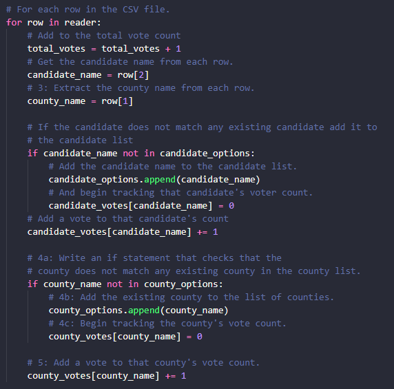
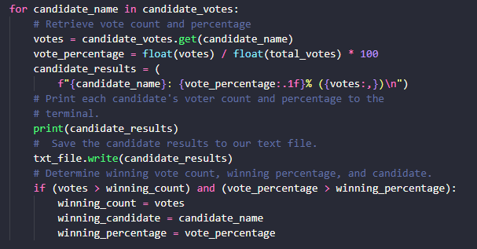
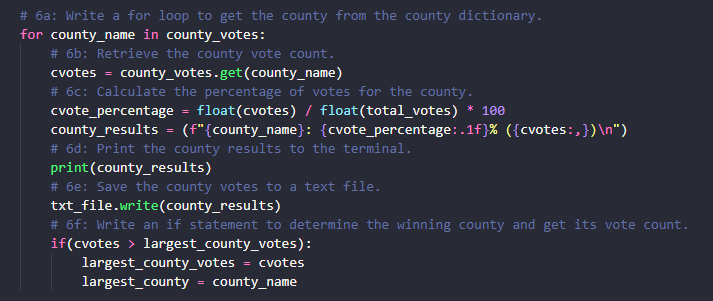

# Election_Analysis

## Challenge Overview
### Overview of Election Audit
The purpose of this election audit was to analyze the results of a recent local congressional election that included a voter's ballot ID, the county in which they voted, and the candidate they voted for, and find the following:
- The total number of votes cast in the election.
- The number of votes and % of total votes cast in each county in the election.
- The county that had the largest turnout of voters in the election.
- The number of votes and % of total votes each candidate received in the election. 
- The winner of the election based on popular vote, as well as the number and percentage of votes they received.

## Resources
Data Source: election_results.csv


Software: Python 3.7.6, Visual Studio Code 1.63.2

## Challenge Summary
### Election Audit Results
The analysis of the election show that:
- A total of 369,711 votes were cast in this congressional election.  

- The counties in the precinct were:
  - Jefferson
  - Denver
  - Arapahoe

- The county results were:
  - 10.5% of the votes (equal to 38,855 votes) were cast in Jefferson county.
  - 82.8% of the votes (equal to 306,055 votes) were cast in Denver county.
  - 6.7% of the votes (equal to 24,801 votes) were cast in Arapahoe county.
- Denver county had the largest number of votes.

- The candidates in the election were:
  - Charles Casper Stockham
  - Diana DeGette
  - Raymon Anthony Doane

- The candidate results were:
  - Charles Casper Stockham received 23.0% of the vote and 85,213 votes.   
  - Diana DeGette received 73.8% of the vote and 272,892 votes.   
  - Raymon Anthony Doane received 3.1% of the vote and 11,606 votes.   

- The winner of the election was:
  - Diana DeGette, who received 73.8% of the total vote and 272,892 votes.

Looping through each row of the csv file, total votes were calculated by adding 1 to the total vote counter (initially set to zero).  The candidate and county names were found by adding each name to a list (given that the name did not already exist in the list).  The number of votes were tallied by adding one to each candidate/county name in each row. 

```python
# Initialize a total vote counter.
total_votes = 0

# Candidate Options and candidate votes.
candidate_options = []
candidate_votes = {}

# 1: Create a county list and county votes dictionary.
county_options = []
county_votes = {}

# Track the winning candidate, vote count and percentage
winning_candidate = ""
winning_count = 0
winning_percentage = 0

# 2: Track the largest county and county voter turnout.
largest_county = ""
largest_county_votes = 0

# Read the csv and convert it into a list of dictionaries
with open(file_to_load) as election_data:
    reader = csv.reader(election_data)

    # Read the header
    header = next(reader)

    # For each row in the CSV file.
    for row in reader:
        # Add to the total vote count
        total_votes = total_votes + 1
        # Get the candidate name from each row.
        candidate_name = row[2]
        # 3: Extract the county name from each row.
        county_name = row[1]

        # If the candidate does not match any existing candidate add it to
        # the candidate list
        if candidate_name not in candidate_options:
            # Add the candidate name to the candidate list.
            candidate_options.append(candidate_name)
            # And begin tracking that candidate's voter count.
            candidate_votes[candidate_name] = 0
        # Add a vote to that candidate's count
        candidate_votes[candidate_name] += 1

        # 4a: Write an if statement that checks that the
        # county does not match any existing county in the county list.
        if county_name not in county_options:            
            # 4b: Add the existing county to the list of counties.
            county_options.append(county_name)
            # 4c: Begin tracking the county's vote count.
            county_votes[county_name] = 0

        # 5: Add a vote to that county's vote count.
        county_votes[county_name] += 1
        
        ```



Code to calculate number/% of votes each candidate received, as well as find the winner:



Code to calculate number/% of votes each county, as well as find the county with the largets voter turnout:



### Election Audit Summary
One way to modify this script to be used for other elections would be to add variables for additional demographics of voters - for example, if the data included age and gender of voters, you could modify the code to find the number/% of votes based on those criteria.

A second way to modify this script to be used for other elections would be to modify the "county" calculations or add new calculations to calculate voter turnout by new/different geographics (i.e., city or state).

