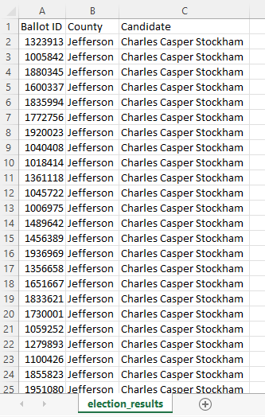

# Election_Analysis

## Challenge Overview
### Overview of Election Audit
The purpose of this election audit was to analyze the results of a recent local congressional election that included a voter's ballot ID, the county in which they voted, and the candidate they voted for, and find the following:
- The total number of votes cast in the election.
- The number of votes and % of total votes cast in each county in the election.
- The county that had the largest turnout of voters in the election.
- The number of votes and % of total votes each candidate received in the election. 
- The winner of the election based on popular vote, as well as the number and percentage of votes they received.

## Resources
Data Source: election_results.csv

Software: Python 3.7.6, Visual Studio Code 1.63.2

## Challenge Summary
### Election Audit Results
The analysis of the election show that:
- A total of 369,711 votes were cast in this congressional election.  
  - Total votes were counted by counting the number rows in the election results file:

    

- The counties in the precinct were:
  - Jefferson
  - Denver
  - Arapahoe
- The county results were:
  - 10.5% of the votes (equal to 38,855 votes) were cast in Jefferson county.
  - 82.8% of the votes (equal to 306,055 votes) were cast in Denver county.
  - 6.7% of the votes (equal to 24,801 votes) were cast in Arapahoe county.
- Denver county had the largest number of votes.

- The candidates in the election were:
  - Charles Casper Stockham
  - Diana DeGette
  - Raymon Anthony Doane
- The candidate results were:
  - Charles Casper Stockham received 23.0% of the vote and 85,213 votes.   
  - Diana DeGette received 73.8% of the vote and 272,892 votes.   
  - Raymon Anthony Doane received 3.1% of the vote and 11,606 votes.   
- The winner of the election was:
  - Diana DeGette, who received 73.8% of the total vote and 272,892 votes.

### Election Audit Summary
